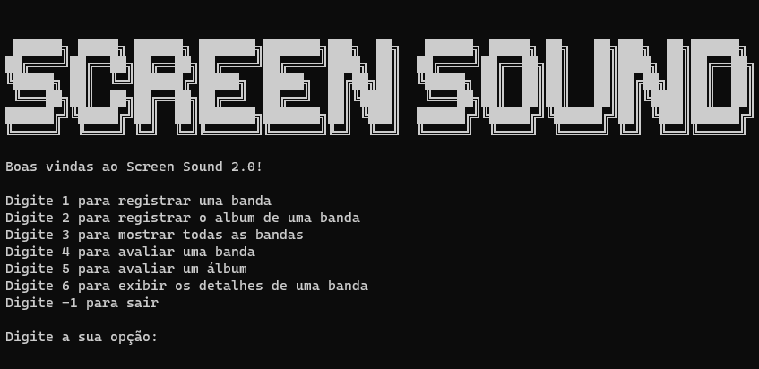

# ScreenSound

</a>

Repositório criado para fins educacionais e para expôr o projeto feito durante os cursos **C#: criando sua primeira aplicação**, **C#: aplicando a Orientação a Objetos** e **C#: dominando Orientação a Objetos** da [Alura](https://www.alura.com.br).

## Objetivo
Aprender a sintaxe básica de C# e o paradigma da Orientação a Objetos.

## Ferramentas

